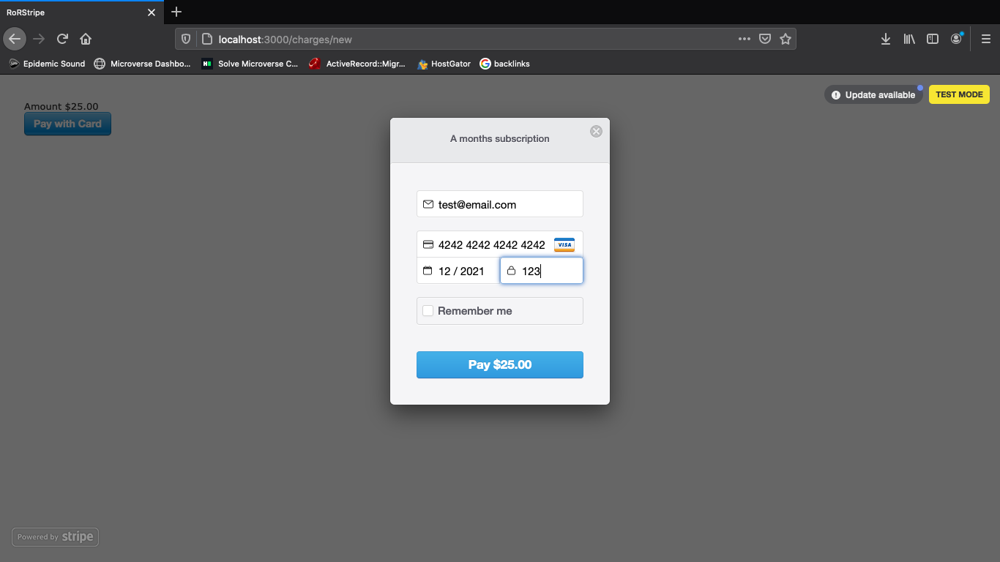

# Rails Stripe API

## Objectives

1. REST API with Stripe
2. Demo the power of Rails =)

## Overview

Stay tuned to our feature branch to see the live Stripe API testing line by line...you know #gitflow

### Your Uncomplicated Rrails Stripe API!

Feel free to use this test api with stripe so you can integrate to your site =)

## Built With

- Ruby, Ruby on rails and Stripe REST API.

## Getting Started

1. Clone directory $ git clone https://github.com/rootDEV2990/RoR_stripe
2. Open terminal type cd /path/to/folder and hit enter.
3. Launch webpacker server in terminal type rails s and hit enter.
4. Open web browser and point it to http://localhost:3000

### Prerequisites

Ruby installed on your computer to be able to run rails.

## What it does:

1. Connects to your Stripe account.
2. Processes a payment.

## Authors

👤 **Miguel Angel Enciso Sanchez**

- Github: [@rootDEV2990](https://github.com/rootDEV2990)
- Twitter: [@m29902](https://twitter.com/m29902)
- Linkedin: [linkedin](https://www.linkedin.com/in/miguel-enciso-6474741a1/)
- Medium: [medium](https://medium.com/@website.dev)

## 🤝 Contributing

Contributions, issues and feature requests are welcome!

Feel free to check the [issues page](issues/).

## Show your support

Give a ⭐️ if you like this project!

Bitcoin donations accepted ;)

1AD5ANtHmqemTZ2Qmv5UqJAMijTNyCAH8D 🚀
